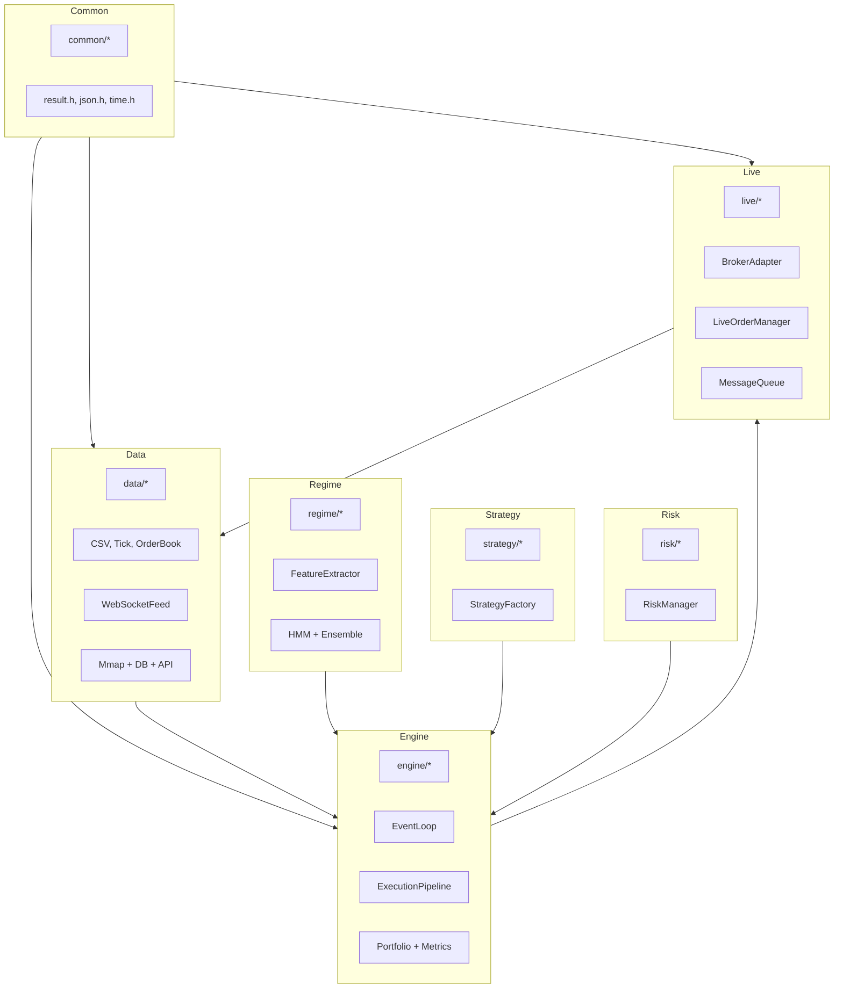

# Architecture

This section maps the core components to the concrete code modules and shows
how they interact in both backtest and live trading flows.

## Component Diagram

## Module-to-File Map

- `common/`: core utilities, results, time, JSON parsing
- `data/`: sources, validation, CSV readers, mmap storage, websocket feeds
- `regime/`: HMM, ensemble detection, features, state transitions
- `engine/`: event loop, execution pipeline, portfolio, order management
- `execution/`: execution models, slippage, market impact, latency models
- `risk/`: risk limits, position sizing, stop-loss
- `strategy/`: strategy interface, factories, built-ins
- `live/`: broker adapters, live engine, MQ adapters

## Key Interactions

1. `data::DataSource` emits bars/ticks into `engine::EventLoop`.
2. `regime::FeatureExtractor` computes features and updates `RegimeDetector`.
3. `strategy::Strategy` consumes market events and regime state to create orders.
4. `execution::ExecutionPipeline` simulates or routes orders and updates portfolio.
5. `metrics::*` compute performance and regime attribution.

## Interpretation

Interpretation: the architecture diagram maps each code module to the system layers and shows the dependencies between them.

