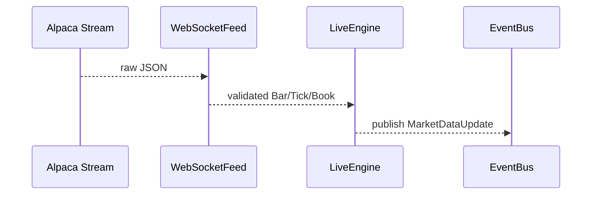

# Broker Streaming Flows

This section shows how live market data and execution reports flow from each broker into RegimeFlow.

## Alpaca Streaming

```mermaid
sequenceDiagram
  participant AlpacaWS as Alpaca Stream
  participant WebSocketFeed
  participant LiveEngine
  participant EventBus

  AlpacaWS-->>WebSocketFeed: raw JSON
  WebSocketFeed-->>LiveEngine: validated Bar/Tick/Book
  LiveEngine-->>EventBus: publish MarketDataUpdate
```

