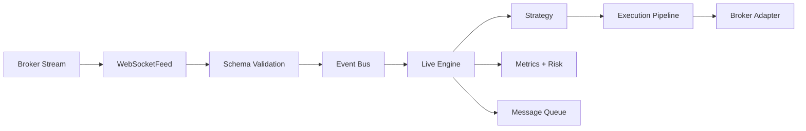

# Data Flow

This document explains how market data moves through the system for both
backtesting and live execution.

## Backtest Data Flow

```mermaid
flowchart LR
  A[CSV/Tick/OrderBook] --> B[CSV/Tick Readers]
  A2[Alpaca REST (Assets/Bars/Trades)] --> B2[AlpacaDataClient + Pagination]
  B --> C[Validation + Normalization]
  B2 --> C
  C --> D[Bar Builder]
  C --> D2[Tick Stream]
  D --> E[Event Generator]
  D2 --> E
  E --> F[Event Loop]
  F --> G[Strategy Context]
  G --> H[Strategy]
  H --> I[Execution Pipeline]
  I --> J[Portfolio + Metrics]
```


## Live Data Flow




## How Components Interact

- **Validation** ensures schema and pricing sanity before data is used.
- **Bar Builder** aggregates ticks into bars if needed.
- **Event Loop** is the single ingestion point for strategy logic.
- **Execution Pipeline** simulates fills in backtest or routes to broker in live.


## Interpretation

Interpretation: raw data is validated, normalized, and transformed into events consumed by strategy and execution.
