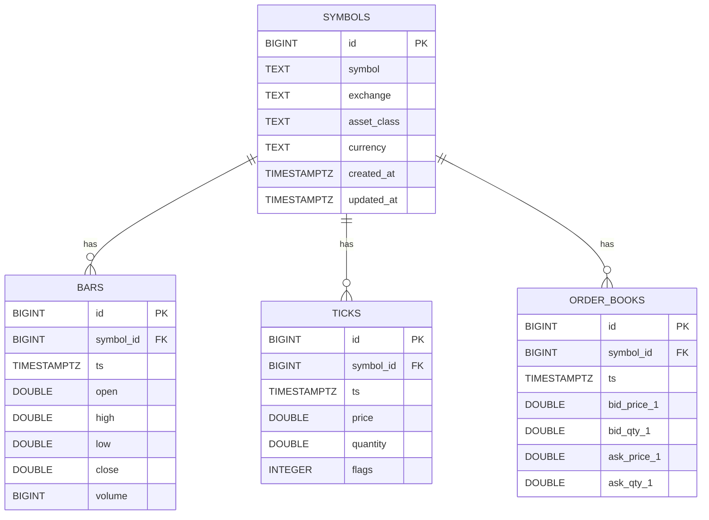

# Database

This diagram reflects the Postgres schema used by RegimeFlow.

## Interpretation

Interpretation: symbols are the primary entity, and bars/ticks/order books reference them by symbol_id.

