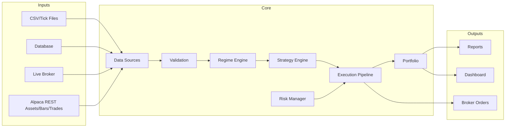

# Component Diagram

```mermaid
flowchart LR
  subgraph Inputs
    A[CSV/Tick Files]
    B[Database]
    C[Live Broker]
    A2[Alpaca REST Assets/Bars/Trades]
  end

  subgraph Core
    D[Data Sources]
    E[Validation]
    F[Regime Engine]
    G[Strategy Engine]
    H[Execution Pipeline]
    I[Risk Manager]
    J[Portfolio]
  end

  subgraph Outputs
    K[Reports]
    L[Dashboard]
    M[Broker Orders]
  end

  A --> D
  B --> D
  C --> D
  A2 --> D
  D --> E
  E --> F
  F --> G
  G --> H
  I --> H
  H --> J
  J --> K
  J --> L
  H --> M
```
