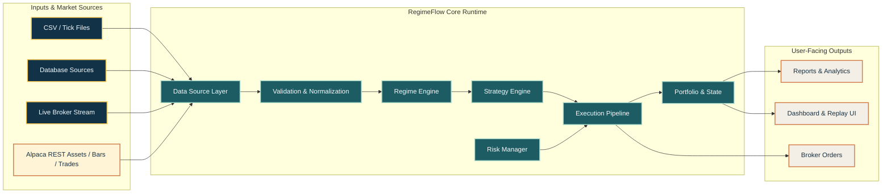

# Component Diagram

```mermaid
%%{init: {"flowchart": {"curve": "basis"}}}%%
flowchart LR
  classDef input fill:#113247,stroke:#f2c14e,color:#f8fbfd,stroke-width:2px;
  classDef core fill:#1d5c63,stroke:#a7d8c9,color:#f8fbfd,stroke-width:2px;
  classDef output fill:#f4efe6,stroke:#d17b49,color:#173042,stroke-width:2px;
  classDef external fill:#fff4d6,stroke:#d17b49,color:#173042,stroke-width:2px;

  subgraph Inputs["Inputs & Market Sources"]
    A[CSV / Tick Files]
    B[Database Sources]
    C[Live Broker Stream]
    A2[Alpaca REST Assets / Bars / Trades]
  end

  subgraph Core["RegimeFlow Core Runtime"]
    D[Data Source Layer]
    E[Validation & Normalization]
    F[Regime Engine]
    G[Strategy Engine]
    H[Execution Pipeline]
    I[Risk Manager]
    J[Portfolio & State]
  end

  subgraph Outputs["User-Facing Outputs"]
    K[Reports & Analytics]
    L[Dashboard & Replay UI]
    M[Broker Orders]
  end

  A --> D
  B --> D
  C --> D
  A2 --> D
  D --> E
  E --> F
  F --> G
  G --> H
  I --> H
  H --> J
  J --> K
  J --> L
  H --> M

  class A,B,C input
  class A2 external
  class D,E,F,G,H,I,J core
  class K,L,M output
```
