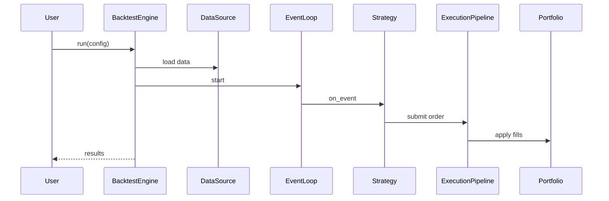

# Backtest Sequence

```mermaid
sequenceDiagram
  participant User
  participant BacktestEngine
  participant DataSource
  participant EventLoop
  participant Strategy
  participant ExecutionPipeline
  participant Portfolio

  User->>BacktestEngine: run(config)
  BacktestEngine->>DataSource: load data
  BacktestEngine->>EventLoop: start
  EventLoop->>Strategy: on_event
  Strategy->>ExecutionPipeline: submit order
  ExecutionPipeline->>Portfolio: apply fills
  BacktestEngine-->>User: results
```
