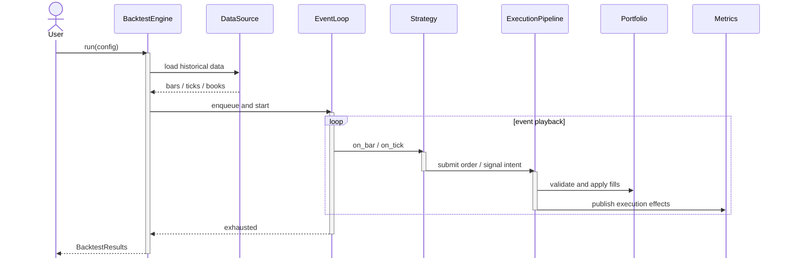

# Backtest Sequence

```mermaid
%%{init: {"sequence": {"mirrorActors": false, "actorMargin": 56, "messageMargin": 28}}}%%
sequenceDiagram
  actor User
  participant BacktestEngine as BacktestEngine
  participant DataSource as DataSource
  participant EventLoop as EventLoop
  participant Strategy as Strategy
  participant ExecutionPipeline as ExecutionPipeline
  participant Portfolio as Portfolio
  participant Metrics as Metrics

  User->>BacktestEngine: run(config)
  activate BacktestEngine
  BacktestEngine->>DataSource: load historical data
  DataSource-->>BacktestEngine: bars / ticks / books
  BacktestEngine->>EventLoop: enqueue and start
  activate EventLoop
  loop event playback
    EventLoop->>Strategy: on_bar / on_tick
    activate Strategy
    Strategy->>ExecutionPipeline: submit order / signal intent
    deactivate Strategy
    activate ExecutionPipeline
    ExecutionPipeline->>Portfolio: validate and apply fills
    ExecutionPipeline->>Metrics: publish execution effects
    deactivate ExecutionPipeline
  end
  EventLoop-->>BacktestEngine: exhausted
  deactivate EventLoop
  BacktestEngine-->>User: BacktestResults
  deactivate BacktestEngine
```
