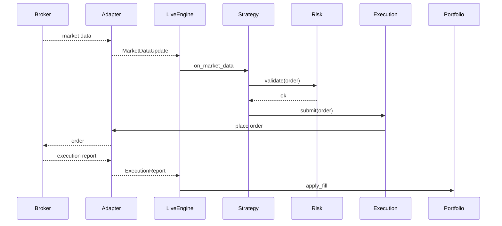

# Live Trading Sequence

```mermaid
sequenceDiagram
  participant Broker
  participant Adapter
  participant LiveEngine
  participant Strategy
  participant Risk
  participant Execution
  participant Portfolio

  Broker-->>Adapter: market data
  Adapter-->>LiveEngine: MarketDataUpdate
  LiveEngine->>Strategy: on_market_data
  Strategy->>Risk: validate(order)
  Risk-->>Strategy: ok
  Strategy->>Execution: submit(order)
  Execution->>Adapter: place order
  Adapter-->>Broker: order
  Broker-->>Adapter: execution report
  Adapter-->>LiveEngine: ExecutionReport
  LiveEngine->>Portfolio: apply_fill
```
