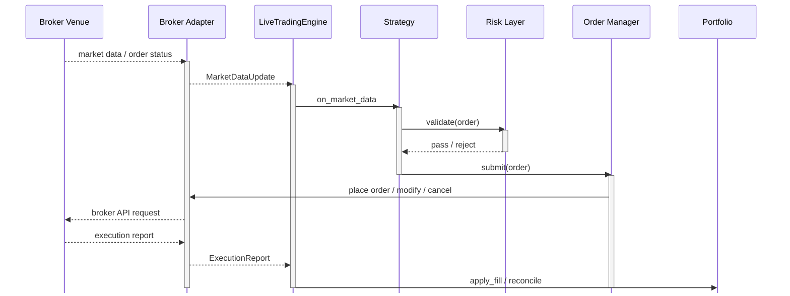

# Live Trading Sequence

```mermaid
%%{init: {"sequence": {"mirrorActors": false, "actorMargin": 56, "messageMargin": 28}}}%%
sequenceDiagram
  participant Broker as Broker Venue
  participant Adapter as Broker Adapter
  participant LiveEngine as LiveTradingEngine
  participant Strategy as Strategy
  participant Risk as Risk Layer
  participant Execution as Order Manager
  participant Portfolio as Portfolio

  Broker-->>Adapter: market data / order status
  activate Adapter
  Adapter-->>LiveEngine: MarketDataUpdate
  activate LiveEngine
  LiveEngine->>Strategy: on_market_data
  activate Strategy
  Strategy->>Risk: validate(order)
  activate Risk
  Risk-->>Strategy: pass / reject
  deactivate Risk
  Strategy->>Execution: submit(order)
  deactivate Strategy
  activate Execution
  Execution->>Adapter: place order / modify / cancel
  Adapter-->>Broker: broker API request
  Broker-->>Adapter: execution report
  Adapter-->>LiveEngine: ExecutionReport
  LiveEngine->>Portfolio: apply_fill / reconcile
  deactivate Execution
  deactivate LiveEngine
  deactivate Adapter
```
