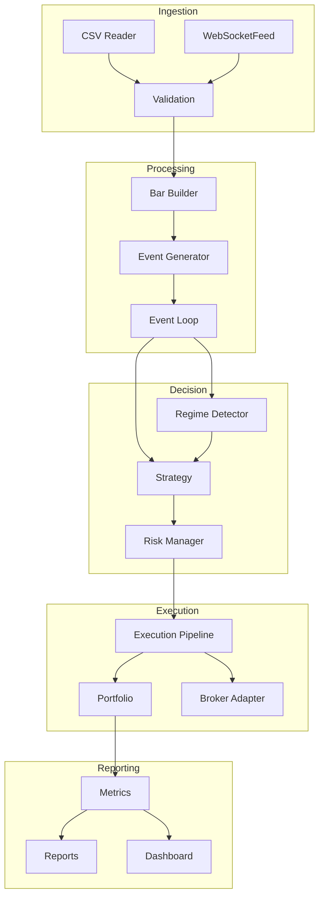

# Structural Flow

```mermaid
flowchart TB
  subgraph Ingestion
    A[CSV Reader] --> B[Validation]
    C[WebSocketFeed] --> B
  end

  subgraph Processing
    B --> D[Bar Builder]
    D --> E[Event Generator]
    E --> F[Event Loop]
  end

  subgraph Decision
    F --> G[Strategy]
    F --> H[Regime Detector]
    H --> G
    G --> I[Risk Manager]
  end

  subgraph Execution
    I --> J[Execution Pipeline]
    J --> K[Portfolio]
    J --> L[Broker Adapter]
  end

  subgraph Reporting
    K --> M[Metrics]
    M --> N[Reports]
    M --> O[Dashboard]
  end
```
