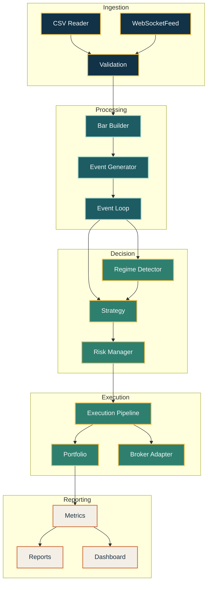

# Structural Flow

```mermaid
%%{init: {"flowchart": {"curve": "basis"}}}%%
flowchart TB
  classDef ingest fill:#113247,stroke:#f2c14e,color:#f8fbfd,stroke-width:2px;
  classDef process fill:#1d5c63,stroke:#a7d8c9,color:#f8fbfd,stroke-width:2px;
  classDef decision fill:#2f7f6f,stroke:#f2c14e,color:#f8fbfd,stroke-width:2px;
  classDef output fill:#f4efe6,stroke:#d17b49,color:#173042,stroke-width:2px;

  subgraph Ingestion["Ingestion"]
    A[CSV Reader] --> B[Validation]
    C[WebSocketFeed] --> B
  end

  subgraph Processing["Processing"]
    B --> D[Bar Builder]
    D --> E[Event Generator]
    E --> F[Event Loop]
  end

  subgraph Decision["Decision"]
    F --> G[Strategy]
    F --> H[Regime Detector]
    H --> G
    G --> I[Risk Manager]
  end

  subgraph Execution["Execution"]
    I --> J[Execution Pipeline]
    J --> K[Portfolio]
    J --> L[Broker Adapter]
  end

  subgraph Reporting["Reporting"]
    K --> M[Metrics]
    M --> N[Reports]
    M --> O[Dashboard]
  end

  class A,B,C ingest
  class D,E,F process
  class G,H,I,J,K,L decision
  class M,N,O output
```
