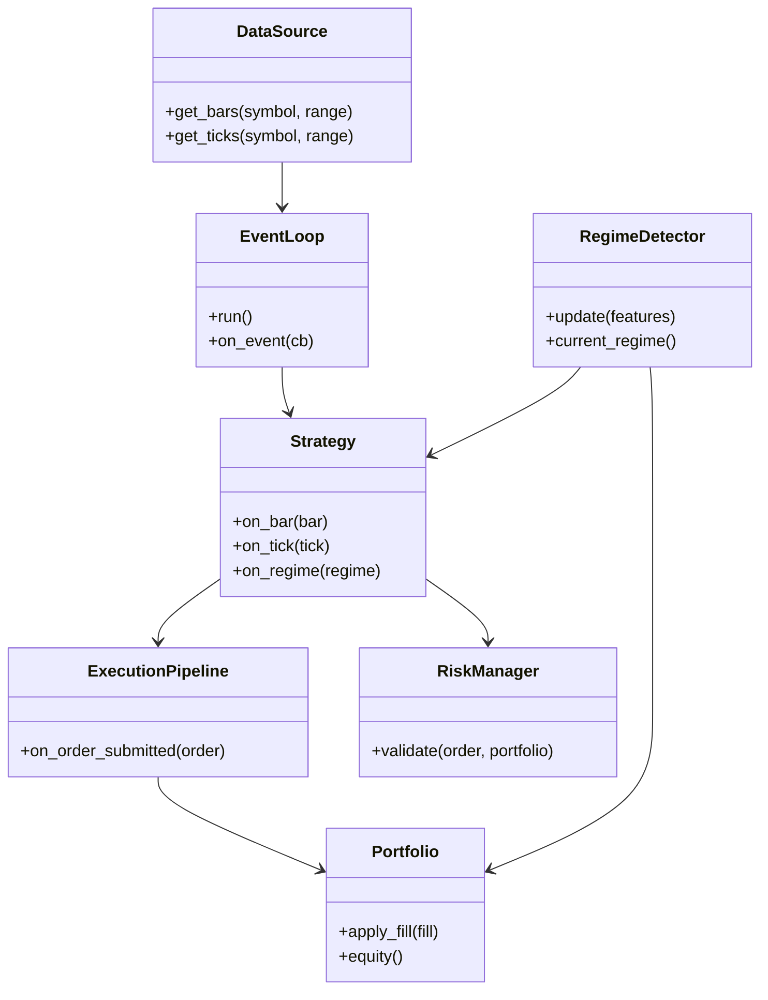

# UML Class Diagram

```mermaid
classDiagram
  class DataSource {
    +get_bars(symbol, range)
    +get_ticks(symbol, range)
  }

  class EventLoop {
    +run()
    +on_event(cb)
  }

  class Strategy {
    +on_bar(bar)
    +on_tick(tick)
    +on_regime(regime)
  }

  class ExecutionPipeline {
    +on_order_submitted(order)
  }

  class RiskManager {
    +validate(order, portfolio)
  }

  class RegimeDetector {
    +update(features)
    +current_regime()
  }

  class Portfolio {
    +apply_fill(fill)
    +equity()
  }

  DataSource --> EventLoop
  EventLoop --> Strategy
  Strategy --> ExecutionPipeline
  ExecutionPipeline --> Portfolio
  Strategy --> RiskManager
  RegimeDetector --> Strategy
  RegimeDetector --> Portfolio
```
