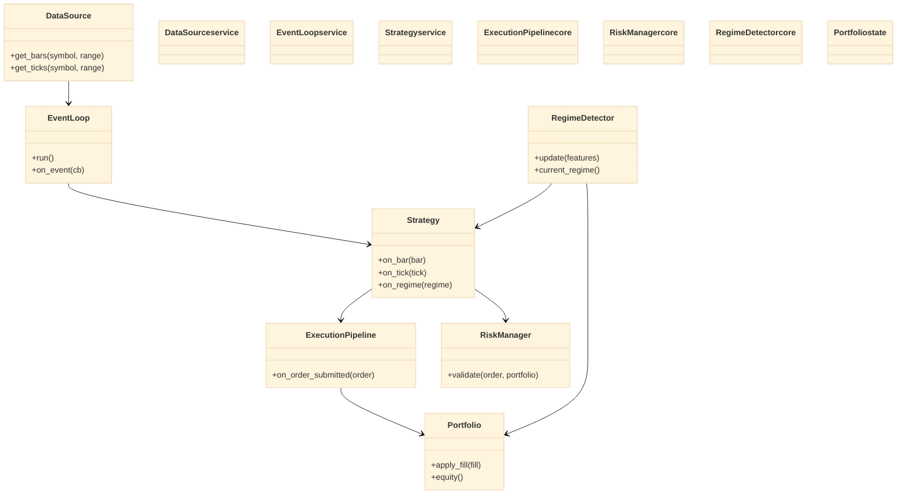

# UML Class Diagram

```mermaid
%%{init: {"theme": "base"}}%%
classDiagram
  classDef service fill:#113247,stroke:#f2c14e,color:#f8fbfd,stroke-width:2px;
  classDef core fill:#1d5c63,stroke:#a7d8c9,color:#f8fbfd,stroke-width:2px;
  classDef state fill:#f4efe6,stroke:#d17b49,color:#173042,stroke-width:2px;

  class DataSource {
    +get_bars(symbol, range)
    +get_ticks(symbol, range)
  }

  class EventLoop {
    +run()
    +on_event(cb)
  }

  class Strategy {
    +on_bar(bar)
    +on_tick(tick)
    +on_regime(regime)
  }

  class ExecutionPipeline {
    +on_order_submitted(order)
  }

  class RiskManager {
    +validate(order, portfolio)
  }

  class RegimeDetector {
    +update(features)
    +current_regime()
  }

  class Portfolio {
    +apply_fill(fill)
    +equity()
  }

  DataSource --> EventLoop
  EventLoop --> Strategy
  Strategy --> ExecutionPipeline
  ExecutionPipeline --> Portfolio
  Strategy --> RiskManager
  RegimeDetector --> Strategy
  RegimeDetector --> Portfolio

  class DataSource service
  class EventLoop service
  class Strategy service
  class ExecutionPipeline core
  class RiskManager core
  class RegimeDetector core
  class Portfolio state
```
