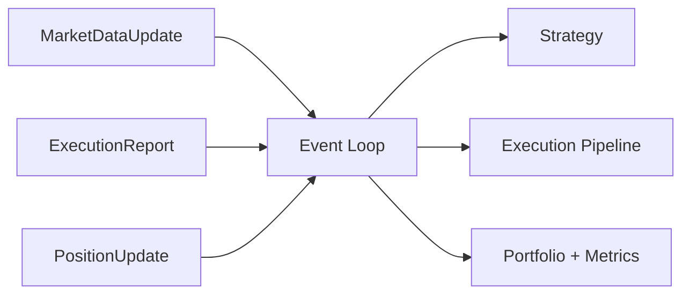

# Event Model

The event model unifies backtest and live trading. Every update is normalized into
well‑defined event types so strategy and execution logic remain consistent.

## Event Categories

## Interpretation

Events are time‑ordered updates that carry prices, fills, and positions. The event
loop guarantees consistent ordering for strategy logic.
