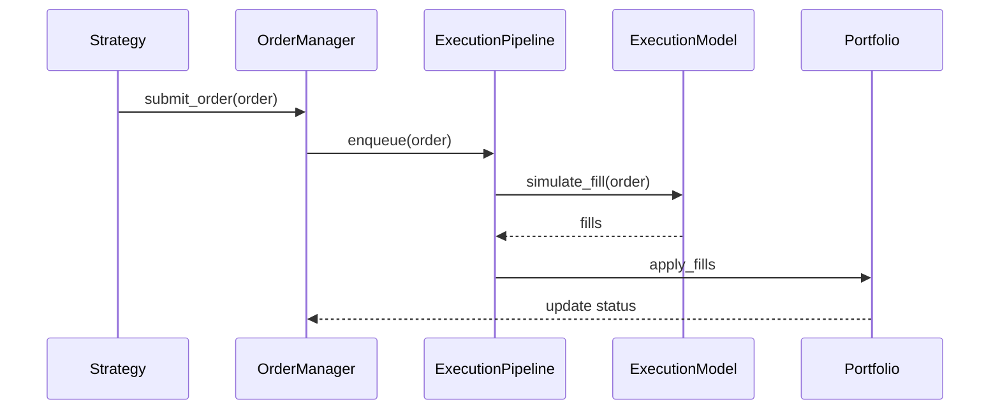
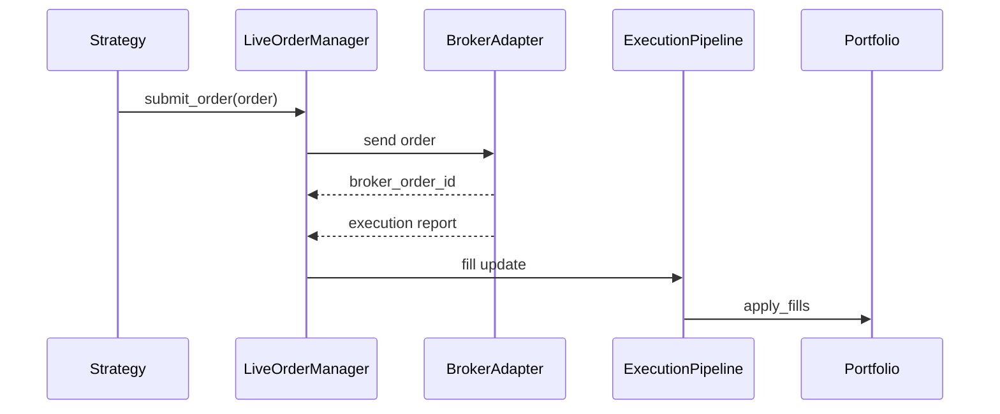

# Execution Flow

This document describes how orders are created, validated, executed, and tracked.

## Order Lifecycle (Backtest)

## Order Lifecycle (Live)

## Execution Model Injection

Execution models are selected via `execution::ExecutionFactory` and can be extended
without changing strategy or engine logic.

## Interpretation

Interpretation: orders move from strategy into the execution pipeline, producing fills that update the portfolio.

