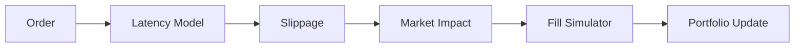

# Execution Models

Execution models control how orders are filled in backtests and how costs are modeled.

## Symbols

Let:
- $Q$ = order quantity
- $P_0$ = reference price
- $\delta$ = slippage amount
- $I$ = market impact
- $c$ = commission per unit

## Execution Model Flow

## Formula Example (LaTeX)

$$
P_f = P_0 + \delta + I
$$

Interpretation: final fill price equals reference price plus slippage and impact.
