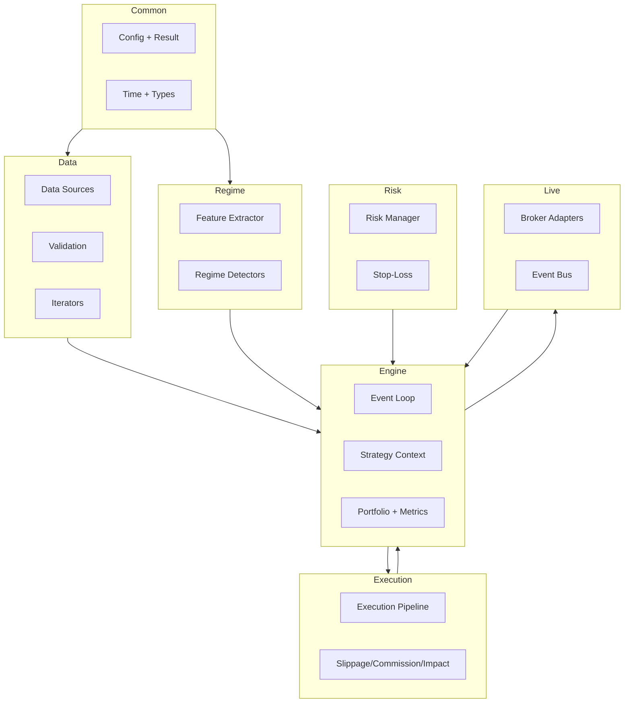

# Architecture

RegimeFlow is layered to keep market data ingestion, strategy logic, execution modeling, and live integration decoupled. The core runtime is C++20 with optional Python bindings.

## Layering

- **Common**: utilities, time, config, JSON/YAML helpers.
- **Data**: data sources, validation, normalization, and iterators.
- **Regime**: feature extraction and detectors.
- **Strategy**: strategy contract and built-in strategies.
- **Execution**: slippage, commission, impact, latency models.
- **Risk**: limits and stop-loss logic.
- **Engine**: orchestrates event loop and portfolio state.
- **Live**: broker adapters, event bus, live engine.
- **Plugins**: extension interfaces for data, regime, execution, strategy, risk, metrics.

## Architecture Diagram

## Module Map

- `include/regimeflow/common/*` foundational types and config.
- `include/regimeflow/data/*` data sources and validation.
- `include/regimeflow/regime/*` feature extraction and detectors.
- `include/regimeflow/strategy/*` strategy contract and factory.
- `include/regimeflow/execution/*` cost and execution models.
- `include/regimeflow/risk/*` risk limits and stop-loss.
- `include/regimeflow/engine/*` backtest engine and portfolio.
- `include/regimeflow/live/*` live engine and adapters.
- `include/regimeflow/plugins/*` plugin interfaces and registry.

## Extension Points

Plugins can extend:

- Data sources (`data_source`)
- Regime detectors (`regime_detector`)
- Execution models (`execution_model`)
- Strategies (`strategy`)
- Risk managers (`risk_manager`)
- Metrics (`metrics`)

See `reference/plugin-api.md` and `reference/plugins.md`.
