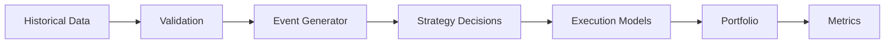

# Backtest Methodology

This section explains how RegimeFlow ensures fair backtests.

## Symbols

Let:
- $P_f$ = final fill price
- $P_0$ = reference price
- $\delta$ = slippage
- $I$ = market impact

## Flow

## Fill Price (LaTeX)

$$
P_f = P_0 + \delta + I
$$

Interpretation: fills incorporate both slippage and impact, not just mid‑price.
