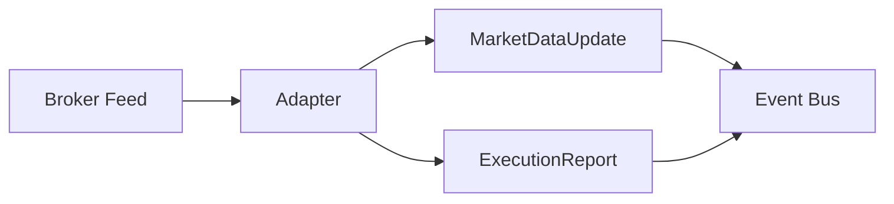

# Broker Streaming

Broker adapters can stream market data and execution updates. These are normalized into `MarketDataUpdate` and `ExecutionReport` messages and then dispatched through the live event bus.

## Streaming Diagram

## Streaming Modes

- **Push**: broker delivers events over WebSocket or streaming HTTP.
- **Poll**: broker requires periodic polling via adapter `poll()`.

Adapters may use both, depending on the broker.
