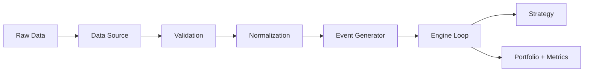

# Data Flow

Data moves through RegimeFlow in a predictable pipeline: ingestion, validation, normalization, then conversion into events for the engine.

## Pipeline Diagram

## Pipeline Stages

1. **Ingestion** from CSV, API, DB, or mmap sources.
2. **Validation** rules applied to timestamps, price bounds, gaps, and outliers.
3. **Normalization** into canonical bars, ticks, and order books.
4. **Event generation** for the engine loop.

## Data Source Factory

The data source is built by `DataSourceFactory::create` from the `data` config. See `guide/data-sources.md` for supported types and fields.

## Validation Controls

Validation behavior is configured under `validation.*` and applies to CSV, API, and DB sources.

See:
- `reference/data-validation.md`
- `guide/data-sources.md`

## Event Output

The output of the data pipeline is a stream of `Bar`, `Tick`, `OrderBook`, and system events that feed the strategy context.
