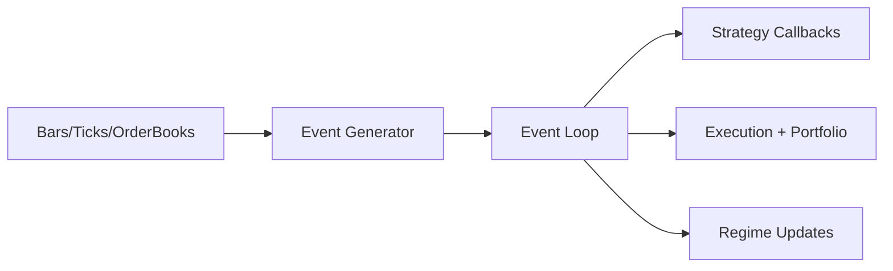

# Event Model

The engine consumes a unified event stream of market data and system events. Strategies react via lifecycle callbacks.

## Event Flow

## Event Types

- `Bar`, `Tick`, `OrderBook` from data sources.
- Order updates and fills from the execution pipeline.
- System events such as timer callbacks and end-of-day.

## Strategy Callbacks

A strategy may implement:

- `initialize(ctx)`
- `on_start()` / `on_stop()`
- `on_bar(bar)`
- `on_tick(tick)`
- `on_order_book(book)`
- `on_order_update(order)`
- `on_fill(fill)`
- `on_regime_change(transition)`
- `on_end_of_day(date)`
- `on_timer(timer_id)`

These callbacks are identical in C++ and Python strategies.
