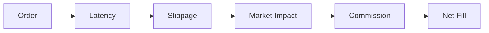

# Execution Costs

Execution models simulate realistic trading costs in backtests.

## Symbols

Let:
- $Q$ = order quantity
- $P_0$ = reference price
- $c$ = commission per unit
- $\delta$ = slippage amount
- $I$ = market impact

## Execution Model Flow

## Formulas (LaTeX)

**Commission Cost**

$$
\text{Commission} = c \cdot |Q|
$$

Interpretation: commission is linear in the size of the order.

**Slippage**

$$
P_s = P_0 + \delta
$$

Interpretation: slippage moves the price away from the reference price.

**Market Impact**

$$
P_f = P_s + I
$$

Interpretation: impact adds a size‑dependent penalty to the fill price.
