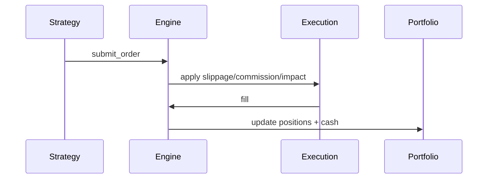

# Execution Flow

Execution is modeled explicitly so backtests reflect realistic cost and fill behavior.

## Execution Diagram

## Steps

1. Strategy submits an order via `StrategyContext`.
2. The execution pipeline applies slippage, commission, impact, and latency.
3. Fills update the portfolio and metrics.

## Execution Configuration

Execution is configured under `execution.*` and implemented by `ExecutionFactory`:

- Slippage models: `zero`, `fixed_bps`, `regime_bps`.
- Commission models: `zero`, `fixed`.
- Transaction cost models: `zero`, `fixed_bps`, `per_share`, `per_order`, `tiered`.
- Market impact models: `zero`, `fixed_bps`, `order_book`.
- Latency model: `latency.ms`.

See `guide/execution-models.md` for full config details.
