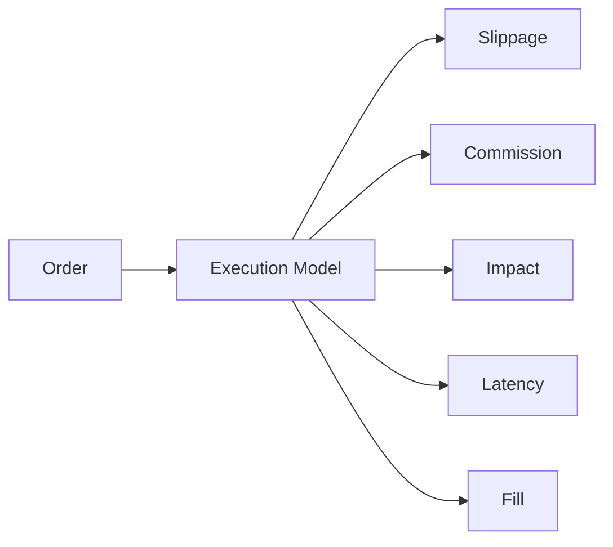

# Execution Models

Execution models are responsible for turning strategy intent into fills with realistic cost and latency. RegimeFlow wires execution through `ExecutionFactory`.

## Model Diagram

## Model Types

- **Basic**: default model that combines slippage, commission, impact, and latency.
- **Plugin**: custom execution models via `execution_model` plugins.

## Cost Components

- Slippage models: `zero`, `fixed_bps`, `regime_bps`.
- Commission models: `zero`, `fixed`.
- Transaction cost models: `zero`, `fixed_bps`, `per_share`, `per_order`, `tiered`.
- Market impact models: `zero`, `fixed_bps`, `order_book`.
- Latency model: fixed latency in milliseconds.

See `guide/execution-models.md` for configuration.
