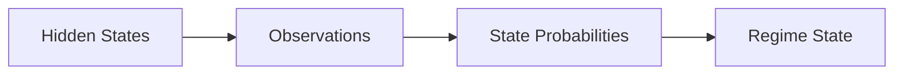

# HMM Math (Conceptual)

The HMM detector models regimes as hidden states that generate observed feature vectors.

## Model Diagram

## Intuition

- Each hidden state has its own statistical profile.
- Observed features are explained by a state-specific distribution.
- Transition probabilities define how regimes shift over time.

## Implementation Notes

RegimeFlow uses rolling windows of features and optional normalization. The model supports optional Kalman smoothing for regime probabilities.

See `guide/regime-detection.md` for configuration.
