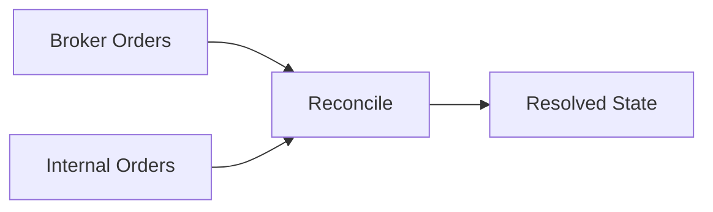

# Live Order Reconciliation

The live engine compares broker truth to internal order state and resolves mismatches. This reduces drift between the system and broker state.

## Reconciliation Diagram

## What Is Reconciled

- Open orders and their statuses.
- Positions and quantities.
- Account equity and buying power.

## Why It Matters

Broker callbacks can be delayed or dropped. Reconciliation ensures the engine converges to broker truth over time.
