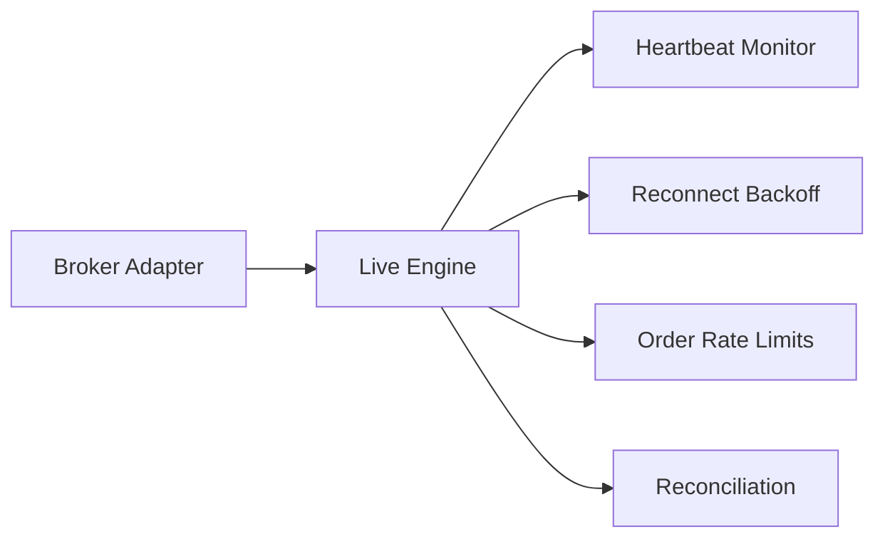

# Live Resiliency

The live engine monitors connectivity, heartbeat health, and order flow to maintain stable trading sessions.

## Resiliency Diagram

## Key Mechanisms

- **Reconnect backoff** using `live.reconnect.*`.
- **Heartbeat timeout** using `live.heartbeat.*`.
- **Rate limiting** using `max_orders_per_minute` and `max_orders_per_second`.
- **Periodic reconciliation** of orders, positions, and account state.

## Operational Signals

The live CLI prints reconnect attempts and heartbeat status, which helps detect data feed degradation or broker instability.

## Thread-Safety Boundaries

Broker callbacks may arrive on transport-owned threads. Live engine handlers that touch portfolio state, order state, replay journals, or audit sinks must acquire the engine-owned synchronization before mutating shared state. In particular, market-data handling updates portfolio marks under the portfolio mutex so account snapshots, reconciliation, and dashboards do not observe torn state.

The event bus has a single dispatch loop and serializes pending-message drains. `stop()` wakes and joins the dispatcher rather than racing an independent drain path.
