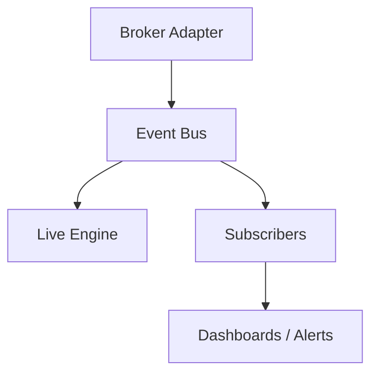

# Message Bus

The live event bus provides in-process routing for market data, execution reports, and system messages. It is implemented in `live/event_bus.h`.

## Bus Diagram

## Topics

- `MarketData`
- `ExecutionReport`
- `PositionUpdate`
- `AccountUpdate`
- `System`

## Usage

- Publishers send `LiveMessage` objects to the bus.
- Subscribers register callbacks per topic.

The event bus is used by the live engine and can be extended with external message queues via the MQ adapter.
