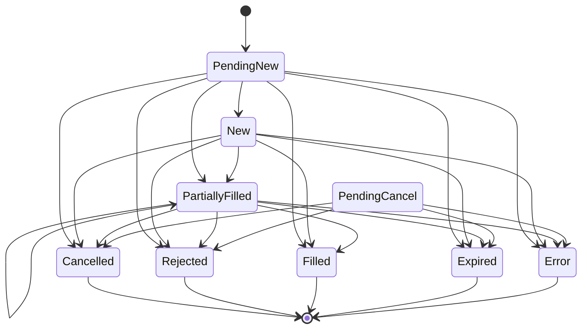

# Order State Machine

This section describes how live orders move through states.

## State Graph

```mermaid
stateDiagram-v2
  [*] --> PendingNew
  PendingNew --> New
  PendingNew --> PartiallyFilled
  PendingNew --> Filled
  PendingNew --> Rejected
  PendingNew --> Cancelled
  PendingNew --> Expired
  PendingNew --> Error

  New --> PartiallyFilled
  New --> Filled
  New --> Cancelled
  New --> Rejected
  New --> Expired
  New --> Error

  PartiallyFilled --> PartiallyFilled
  PartiallyFilled --> Filled
  PartiallyFilled --> Cancelled
  PartiallyFilled --> Rejected
  PartiallyFilled --> Expired
  PartiallyFilled --> Error

  PendingCancel --> Cancelled
  PendingCancel --> Rejected
  PendingCancel --> Expired
  PendingCancel --> Error

  Cancelled --> [*]
  Rejected --> [*]
  Filled --> [*]
  Expired --> [*]
  Error --> [*]
```

