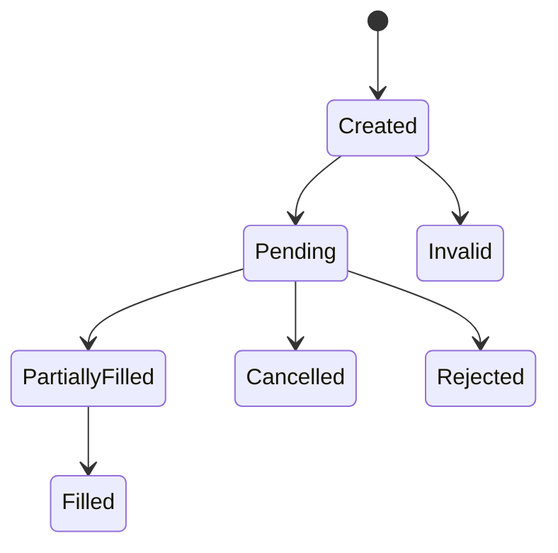

# Order State Machine

Orders are represented by `engine::Order` and transition through a small set of statuses. Statuses are defined in `include/regimeflow/engine/order.h`.

## Status Values

- `Created` order was constructed by a strategy.
- `Pending` order submitted but not yet acknowledged.
- `PartiallyFilled` order has partial fills.
- `Filled` order is fully filled.
- `Cancelled` order was cancelled.
- `Rejected` order was rejected by execution or broker.
- `Invalid` order failed validation before submission.

## Typical Flow

## Notes

- Backtests use the execution pipeline to synthesize fills and update status.
- Live trading maps broker updates into internal `ExecutionReport` messages, which update order state.
