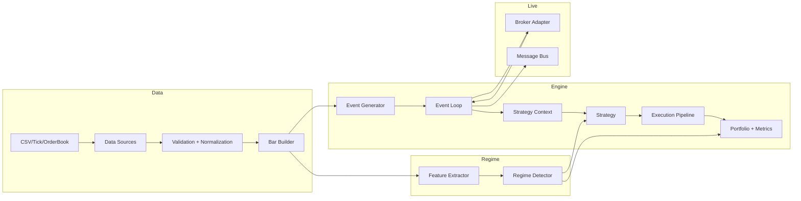

# Overview

RegimeFlow is a C++ core with Python bindings for regime-aware backtesting and live execution. The system is built around a single event pipeline that produces consistent behavior across backtest and live modes.

## What It Provides

- Data ingestion, validation, and canonicalization.
- Regime detection and regime-aware analytics.
- Strategy execution with configurable costs and risk limits.
- Live trading via broker adapters.
- Plugin architecture for detectors, strategies, data sources, and execution models.

## System Map

## Core Guarantees

- One strategy contract for both backtests and live trading.
- One event pipeline for bars, ticks, and order books.
- One configuration surface across C++ and Python formats.

## Where To Go Next

- `explanation/architecture.md`
- `explanation/data-flow.md`
- `explanation/event-model.md`
