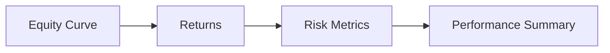

# Performance Metrics

This section describes how performance statistics are computed.

## Metrics Flow

## Symbols

Let:
- $E_t$ = equity at time $t$
- $r_t$ = period return
- $N$ = number of return observations
- $\mu$ = mean return
- $\sigma$ = standard deviation of returns
- $\sigma_d$ = downside deviation (returns below 0)
- $DD_t$ = drawdown at time $t$
- $\Delta t$ = average time between snapshots (seconds)
- $P$ = periods per year
- $b_t$ = benchmark return at time $t$
- $\bar{b}$ = mean benchmark return
- $a_t$ = active return ($r_t - b_t$)

## Formulas (LaTeX)

**Return**

$$
 r_t = \begin{cases}
 \frac{E_t - E_{t-1}}{E_{t-1}}, & E_{t-1} \neq 0 \\
 0, & E_{t-1} = 0
 \end{cases}
$$

Interpretation: return is the percentage change in equity from one period to the next.

**Mean**

$$
\mu = \frac{1}{N}\sum_{t=1}^{N} r_t
$$

Interpretation: average return per period over the full sample.

**Standard Deviation**

$$
\sigma = \sqrt{\frac{1}{N-1}\sum_{t=1}^{N}(r_t - \mu)^2}
$$

Interpretation: dispersion of returns around the mean; higher means more variability.

**Downside Deviation**

$$
\sigma_d = \sqrt{\frac{1}{N_d-1}\sum_{t \in \{r_t < 0\}}(r_t - \mu_d)^2}
$$

Interpretation: variability of only the negative returns; penalizes downside risk.

**Periods Per Year**

$$
P = \frac{365.25 \cdot 24 \cdot 3600}{\Delta t}
$$

Interpretation: converts average time between snapshots into a yearly frequency.

**Annualized Mean**

$$
\mu_{ann} = \mu \cdot P
$$

Interpretation: mean return scaled to a one‑year horizon.

**Annualized Volatility**

$$
\sigma_{ann} = \sigma \cdot \sqrt{P}
$$

Interpretation: volatility scaled to a one‑year horizon.

**Sharpe Ratio (Annualized)**

$$
\text{Sharpe} = \frac{\mu_{ann}}{\sigma_{ann}}
$$

Interpretation: risk‑adjusted return; higher is better for the same volatility.

**Sortino Ratio (Annualized)**

$$
\text{Sortino} = \frac{\mu_{ann}}{\sigma_{d,ann}}
$$

Interpretation: risk‑adjusted return using only downside risk.

**Max Drawdown**

$$
DD_t = \frac{\max_{\tau \le t}(E_\tau) - E_t}{\max_{\tau \le t}(E_\tau)}
$$

$$
\text{MaxDD} = \max_t DD_t
$$

Interpretation: worst peak‑to‑trough decline in the equity curve.

**Calmar Ratio**

$$
\text{Calmar} = \frac{\text{TotalReturn}}{\text{MaxDD}}
$$

Interpretation: return earned per unit of maximum drawdown.

**Alpha / Beta (vs Benchmark)**

Let $b_t$ be benchmark returns and $\bar{b}$ its mean.

$$
\beta = \frac{\sum_{t=1}^{N}(r_t - \mu)(b_t - \bar{b})}{\sum_{t=1}^{N}(b_t - \bar{b})^2}
$$

$$
\alpha = \mu - \beta \cdot \bar{b}
$$

Interpretation: beta measures sensitivity to the benchmark; alpha is excess return after accounting for beta.

**Information Ratio**

Let active returns be $a_t = r_t - b_t$, mean $\bar{a}$, stddev $\sigma_a$.

$$
\text{IR} = \frac{\bar{a}}{\sigma_a}
$$

Interpretation: risk‑adjusted performance of active returns vs the benchmark.

**Rolling Metrics (Window $W$)**

For any metric $M$, compute it on a sliding window of size $W$:

$$
M_t = M(r_{t-W+1}, \ldots, r_t)
$$

Interpretation: shows how metrics evolve over time instead of using one full‑sample value.

## Summary

These are standard quantitative metrics: return series are derived from equity,
then risk and performance ratios are computed from those returns.
