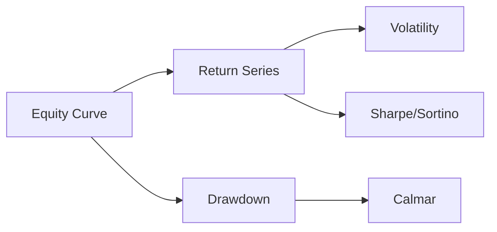

# Performance Metrics

Performance metrics are computed from the equity curve produced by the backtest engine. The calculations live in `metrics/performance_calculator` and are exposed in reports.

## Metrics Diagram

```mermaid
flowchart LR
  A[Equity Curve] --> B[Return Series]
  B --> C[Volatility]
  B --> D[Sharpe/Sortino]
  A --> E[Drawdown]
  E --> F[Calmar]
```

## Common Metrics

- **Return**: period-over-period change in equity.
- **Average return**: mean of returns.
- **Volatility**: standard deviation of returns.
- **Downside volatility**: downside deviation computed against the full return sample.
- **Sharpe ratio**: excess return per unit of total volatility.
- **Sortino ratio**: excess return per unit of downside deviation.
- **Max drawdown**: worst peak-to-trough decline.
- **Calmar ratio**: CAGR divided by max drawdown.

## Regime-Aware Metrics

Regime-aware reporting now follows the same core conventions as the top-level performance summary:

- regime return is compounded across the intervals assigned to that regime
- regime time share is duration-weighted, not sample-count weighted
- regime Sharpe in the final report is taken from the annualized `PerformanceCalculator` path
- transition return is the compounded return over the transition window, averaged across occurrences

This matters most for intraday and event-driven runs, where equal sample counts do not imply equal time in regime.

## Annualization

Metrics are scaled using `periods_per_year`. When the engine has timestamped portfolio snapshots, annualization is inferred from the observed sampling interval instead of assuming daily bars. This keeps `performance` and `performance_summary` aligned on intraday runs.

## Rolling Metrics

Rolling metrics are computed by sliding windows across the equity curve to show time-varying behavior.
