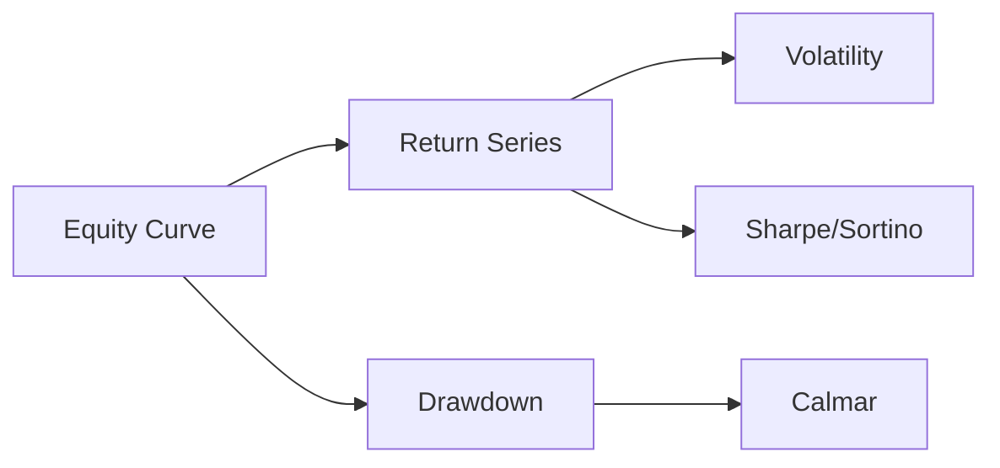

# Performance Metrics

Performance metrics are computed from the equity curve produced by the backtest engine. The calculations live in `metrics/performance_calculator` and are exposed in reports.

## Metrics Diagram

```mermaid
flowchart LR
  A[Equity Curve] --> B[Return Series]
  B --> C[Volatility]
  B --> D[Sharpe/Sortino]
  A --> E[Drawdown]
  E --> F[Calmar]
```

## Common Metrics

- **Return**: period-over-period change in equity.
- **Average return**: mean of returns.
- **Volatility**: standard deviation of returns.
- **Downside volatility**: standard deviation of negative returns.
- **Sharpe ratio**: return per unit of total volatility.
- **Sortino ratio**: return per unit of downside volatility.
- **Max drawdown**: worst peak-to-trough decline.
- **Calmar ratio**: return divided by max drawdown.

## Annualization

Metrics are scaled using `periods_per_year`, which defaults to 252 for daily bars. This is controlled in the calculator and in walk-forward configs.

## Rolling Metrics

Rolling metrics are computed by sliding windows across the equity curve to show time-varying behavior.
