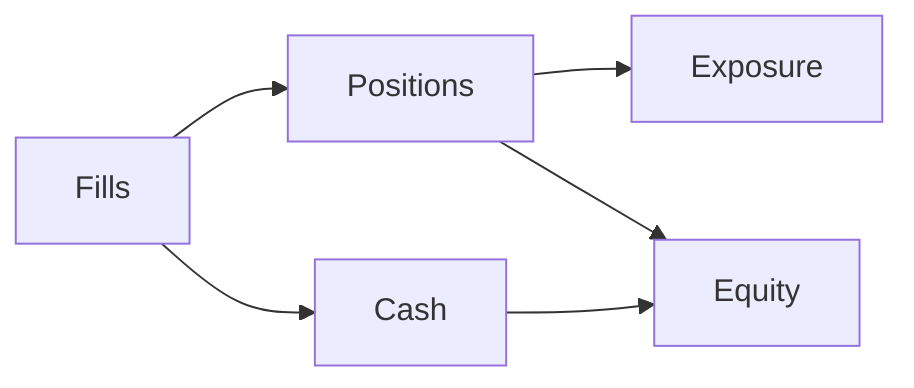

# Portfolio Model

The portfolio tracks positions, cash, equity, and exposure. It is updated by fills from the execution pipeline.

## Portfolio Diagram

## Core Quantities

- **Position value**: `quantity * current_price`.
- **Equity**: `cash + sum(position values)`.
- **Gross exposure**: sum of absolute position values.
- **Net exposure**: sum of signed position values.
- **Leverage**: `gross_exposure / equity`.

## Portfolio Snapshots

The engine emits snapshots for equity curves and performance metrics. These are used by `BacktestResults` and reporting utilities.
