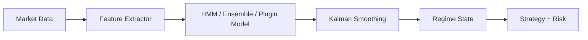

# Regime Detection

RegimeFlow uses market features to classify the market into regimes (e.g., trend, mean-revert, volatile).

## Regime Detection Pipeline

## What It Means

- The system **measures market behavior** (volatility, momentum, etc.).
- A **regime model** classifies the market into categories.
- A **smoother** reduces noisy regime flips.
- Strategies can react differently depending on the regime.

## Custom Models And Labels

RegimeFlow also supports custom regime detectors via plugins (C++ or Python), including transformer-based models.
These detectors can emit **custom regime labels** (for example `risk_on`, `risk_off`, `sideways`), and the
strategies can map those labels to different behavior or strategy selection.

## Interpretation

Interpretation: features are mapped to regime probabilities, then smoothed into a stable state.
