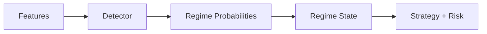

# Regime Detection

Regime detection maps market features to a regime label that can influence strategy selection, risk limits, and execution costs.

## Detection Diagram

```mermaid
flowchart LR
  A[Features] --> B[Detector]
  B --> C[Regime Probabilities]
  C --> D[Regime State]
  D --> E[Strategy + Risk]
```

## Detector Flow

1. Features are extracted from bars or ticks.
2. The detector computes regime probabilities.
3. A stable regime state is emitted to the engine.

## Detector Types

- `constant`
- `hmm`
- `ensemble`
- Plugin detectors

See `guide/regime-detection.md` for configuration details.
