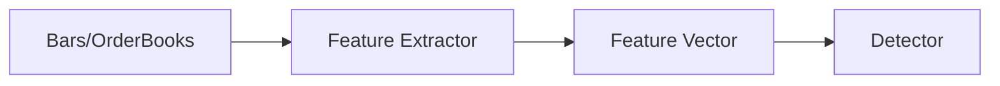

# Regime Features

Regime features are computed by `regime::FeatureExtractor`. The feature list is configurable and supports normalization.

## Feature Flow Diagram

## Supported Features

From `include/regimeflow/regime/features.h`:

- `Return`
- `Volatility`
- `Volume`
- `LogReturn`
- `VolumeZScore`
- `Range`
- `RangeZScore`
- `VolumeRatio`
- `VolatilityRatio`
- `OnBalanceVolume`
- `UpDownVolumeRatio`
- `BidAskSpread`
- `SpreadZScore`
- `OrderImbalance`
- `MarketBreadth`
- `SectorRotation`
- `CorrelationEigen`
- `RiskAppetite`

## Normalization Modes

- `None`
- `ZScore`
- `MinMax`
- `Robust`

Normalization is controlled by `normalize_features` and `normalization` in the HMM config.
