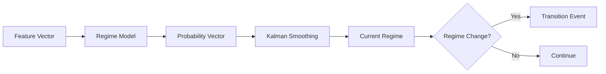

# Regime Transitions (Detailed)

This section explains how regimes are computed and how transitions are detected.

## Regime Transition Flow

## What the Model Does

- The system builds a **feature vector** (volatility, momentum, etc.).
- The regime model outputs **probabilities** for each possible regime.
- A smoothing layer reduces noisy flips.
- When the dominant regime changes, a **transition event** is emitted.

## How Strategies Use It

- Strategies can change behavior depending on the regime.
- Risk limits can be tightened for high‑risk regimes.

## Interpretation

Interpretation: transitions are emitted when the dominant regime changes after smoothing.

