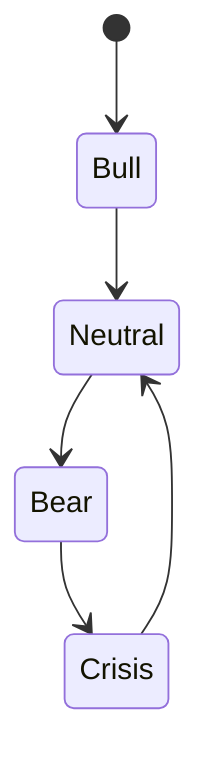

# Regime Transitions

A regime transition is emitted when the detector’s dominant regime changes. The transition carries the previous regime, the new regime, and timing metadata.

## Transition Diagram

```mermaid
stateDiagram-v2
  [*] --> Bull
  Bull --> Neutral
  Neutral --> Bear
  Bear --> Crisis
  Crisis --> Neutral
```

## Transition Fields

From `regime/types.h`:

- `from` previous regime.
- `to` next regime.
- `timestamp` time of transition.
- `confidence` detector confidence.
- `duration_in_from` how long the previous regime persisted.

Transitions are delivered to strategies via `on_regime_change`.
