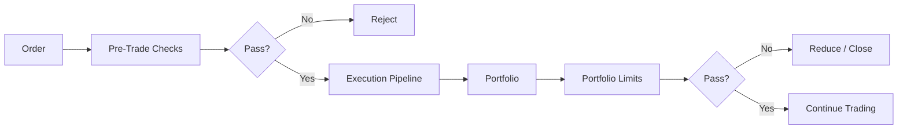

# Risk Controls

Risk limits can be global, per‑strategy, or regime‑specific.

## Risk Control Flow

## What It Means

- Every order is checked against limits before it is sent.
- After fills, the portfolio is checked again for overall exposure.
- If limits are violated, the system can reduce exposure automatically.

## Interpretation

Interpretation: orders are checked against limits before execution and again at the portfolio level.
