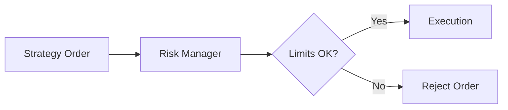

# Risk Controls

Risk controls are enforced by the `RiskManager` and optional stop-loss rules. They are applied in both backtest and live modes.

## Control Diagram

```mermaid
flowchart LR
  A[Strategy Order] --> B[Risk Manager]
  B --> C{Limits OK?}
  C -- Yes --> D[Execution]
  C -- No --> E[Reject Order]
```

## Limit Types

Configured under `limits.*`:

- Notional limits
- Position limits
- Drawdown limits
- Gross and net exposure
- Leverage
- Sector and industry exposure
- Correlation exposure

Regime-specific limits are supported via `limits_by_regime`.

## Stop-Loss Rules

Configured under:

- `stop_loss.*`
- `trailing_stop.*`
- `atr_stop.*`
- `time_stop.*`

See `guide/risk-management.md` for the full key list and examples.
