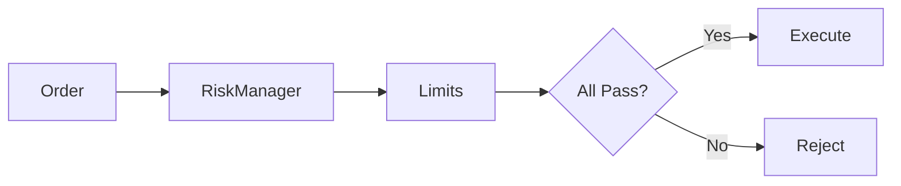

# Risk Limits (Deep Dive)

Risk limits are enforced by `RiskManager` and created by `RiskFactory`. Limits apply at order time and can also validate the portfolio state.

## Limit Evaluation Diagram


```mermaid
flowchart LR
  A[Order] --> B[RiskManager]
  B --> C[Limits]
  C --> D{All Pass?}
  D -- Yes --> E[Execute]
  D -- No --> F[Reject]
```

## Limit Types

- **MaxNotional**: `limits.max_notional` caps order notional.
- **MaxPosition**: `limits.max_position` caps absolute position size.
- **MaxPositionPct**: `limits.max_position_pct` caps position value as a fraction of equity.
- **MaxDrawdown**: `limits.max_drawdown` caps portfolio drawdown fraction.
- **MaxGrossExposure**: `limits.max_gross_exposure` caps total absolute exposure.
- **MaxNetExposure**: `limits.max_net_exposure` caps directional exposure.
- **MaxLeverage**: `limits.max_leverage` caps leverage ratio.

## Sector And Industry Limits

- `limits.sector_limits` maps sector to max exposure pct.
- `limits.sector_map` maps symbol to sector.
- `limits.industry_limits` maps industry to max exposure pct.
- `limits.industry_map` maps symbol to industry.

## Correlation Limit

- `limits.correlation.window` length of the rolling price window.
- `limits.correlation.max_corr` correlation threshold.
- `limits.correlation.max_pair_exposure_pct` cap for correlated pair exposure.

## Regime-Specific Limits

You can apply stricter limits in specific regimes:

```yaml
risk:
  limits:
    max_position_pct: 0.2
  limits_by_regime:
    crisis:
      limits:
        max_position_pct: 0.05
        max_notional: 25000
```

## How Limits Are Evaluated

- Each limit produces `Ok` or a failure with `Error::Code::OutOfRange`.
- The risk manager aggregates all configured limits and rejects orders that violate any limit.
