# Risk Limits

This section explains how risk rules are structured and evaluated.

## Symbols

Let:
- $q$ = order quantity
- $P$ = order price
- $E$ = current equity
- $L_{max}$ = max leverage allowed
- $G$ = gross exposure
- $N$ = net exposure

## Evaluation Path

```mermaid
flowchart TB
  A[Order] --> B[RiskManager::validate]
  B --> C{Regime‑specific limits?}
  C -- Yes --> D[Apply Regime Limits]
  C -- No --> E[Apply Global Limits]
  D --> F{Pass?}
  E --> F
  F -- No --> G[Reject]
  F -- Yes --> H[Proceed]
```

## Example Checks (LaTeX)

**Gross Exposure Limit**

$$
G = \sum_i |q_i P_i|
$$

$$
G \le L_{max} \cdot E
$$

Interpretation: total absolute exposure cannot exceed leverage limit.

**Net Exposure Limit**

$$
N = \sum_i q_i P_i
$$

$$
|N| \le N_{max}
$$

Interpretation: portfolio directional exposure is capped.
