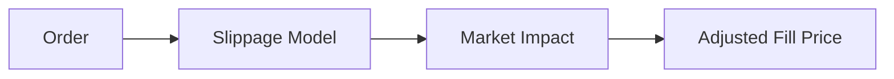

# Slippage & Impact

This section explains how slippage and impact are modeled.

## Symbols

Let:
- $P_0$ = reference price (e.g., mid or last)
- $s$ = slippage adjustment
- $I$ = market impact adjustment
- $P_f$ = final fill price

## Model Flow

## Formulas (LaTeX)

**Slippage‑Adjusted Price**

$$
P_s = P_0 + s
$$

Interpretation: slippage shifts the price away from the ideal reference price.

**Impact‑Adjusted Price**

$$
P_f = P_s + I
$$

Interpretation: impact adds an additional penalty for large or aggressive trades.
