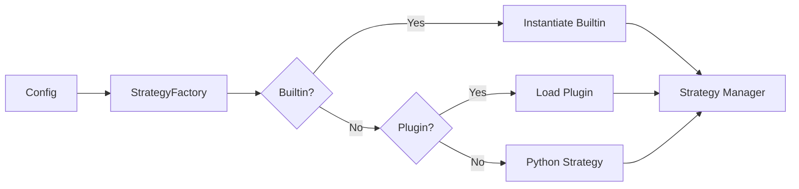

# Strategy Selection

Strategies can be built‑in, plugin‑based, or Python‑defined.

## Strategy Registry Flow

## What It Means

- The system reads the config and chooses a strategy.
- You can plug in your own strategies without changing the core.

## Interpretation

Interpretation: strategies can be built‑in, plugin‑based, or provided in Python.

