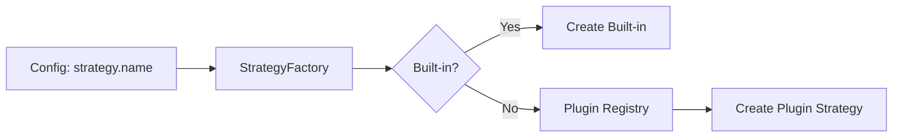

# Strategy Selection

Strategies are created by `StrategyFactory` using either a built-in registry or plugin loading. In Python, strategies can also be provided as `module:Class`.

## Selection Diagram

```mermaid
flowchart LR
  A[Config: strategy.name] --> B[StrategyFactory]
  B --> C{Built-in?}
  C -- Yes --> D[Create Built-in]
  C -- No --> E[Plugin Registry]
  E --> F[Create Plugin Strategy]
```

## Built-In Strategies

Built-ins include:

- `buy_and_hold`
- `moving_average_cross`
- `pairs_trading`
- `harmonic_pattern`

## Plugin Strategies

If `strategy.name` is not a built-in, the factory searches registered plugins. Configure plugin loading in the `plugins` block.

## Python Strategies

Python strategies are loaded by the CLI if `--strategy` is in `module:Class` form and the class extends `regimeflow.Strategy`.

See `guide/strategies.md` for parameter details and examples.
