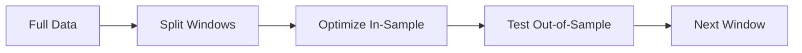

# Walk‑Forward Optimization

Walk‑forward splits data into rolling windows and re‑optimizes parameters.

## Symbols

Let:
- $T$ = total time span
- $W$ = in‑sample window length
- $O$ = out‑of‑sample window length

## Flow

## Windowing (LaTeX)

For each step $k$:

$$
\text{InSample}_k = [t_k, t_k + W]
$$

$$
\text{OutSample}_k = [t_k + W, t_k + W + O]
$$

Interpretation: parameters are trained on one window and validated on the next.
