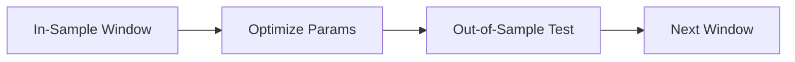

# Walk-Forward Optimization

Walk-forward optimization evaluates parameter stability by training on one window and validating on the next. It reduces overfitting by emphasizing out-of-sample performance.

## Window Diagram

```mermaid
flowchart LR
  A[In-Sample Window] --> B[Optimize Params]
  B --> C[Out-of-Sample Test]
  C --> D[Next Window]
```

## Window Types

- **Rolling**: sliding windows of fixed size.
- **Anchored**: expanding in-sample windows with fixed out-of-sample windows.
- **RegimeAware**: window segmentation based on regime boundaries.

## Overfitting Detection

The optimizer computes an efficiency ratio and flags potential overfitting when in-sample performance is disproportionately higher than out-of-sample performance.

See `guide/walkforward.md` for configuration.
